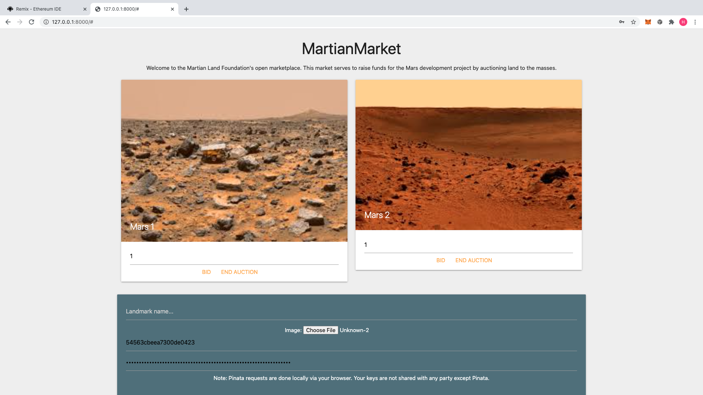
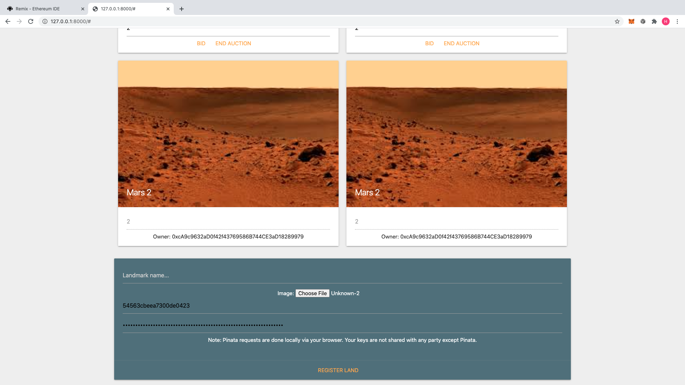
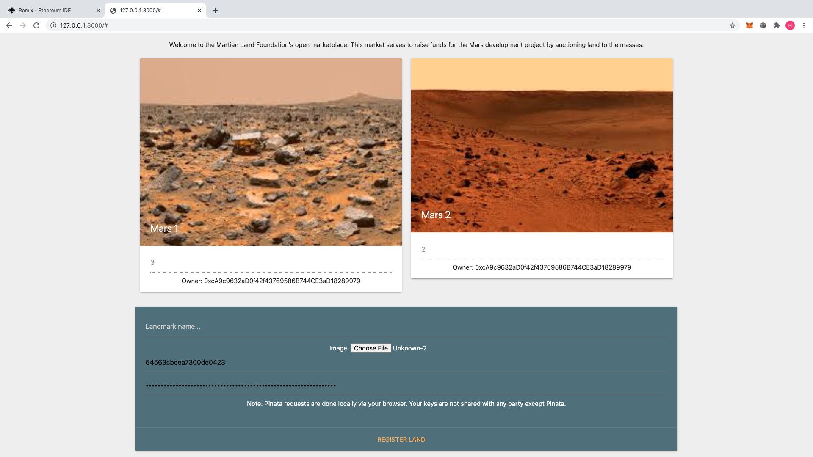

# MartianMarket

## Contributors

@weidongli20

## Technology Stack

- Solidity

## About

- The system will be a combination of an ERC721 contract and an Auction contract combined to form the MartianMarket contract to develop a system to raise funds for Martian land development.

## Demo App

Click [here](https://weidongli20.github.io/martian-market/frontend/index.html) to launch the MartianMarket application

## Installation Instructions

1. Clone the repository
2. Install dependencies
3. Run local http server (e.g. python -m http.server 8000)

## Screenshots

Register Page

Bid Page

Withdraw Page

## License

- MIT

## Contact

#### Developer/FinTech Developer

- Name: wei (@weidongli20)
- e-mail: 4531holly@gmail.com
- Github: [https://github.com/weidongli20](https://github.com/weidongli20)
- LinkedIn: [https://www.linkedin.com/in/weidongli20/](http://www.linkedin.com/in/weidongli20)
